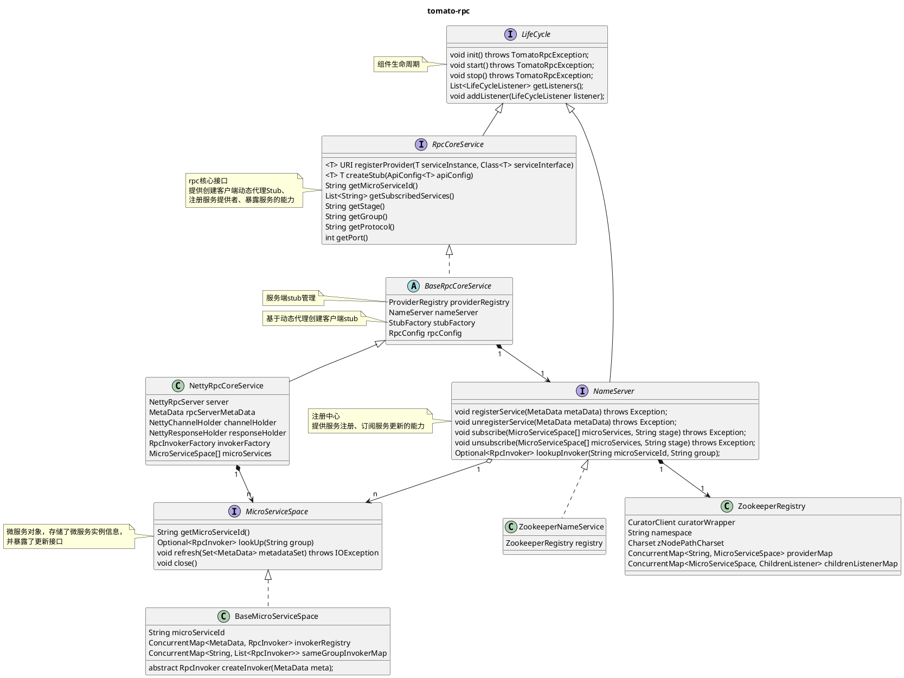

# 项目简介
Tomato-RPC, 业余时间为了巩固微服务基础知识、RPC基础原理而DIY的服务治理/RPC框架。  
项目基于Netty实现RPC网络通信，并使用Zookeeper作为注册中心实现了简单的服务治理。  
项目参考了dubbo、SpringCloud的实现思路。

# 功能特性

## RPC通信
Tomato-RPC的RPC是基于接口的。    
服务端需要注册接口实现类，并将接口数据暴露至注册中心。  
客户端需要订阅接口，并通过Tomato-RPC框架创建一个stub实例，调用stub实例的方法即可完成RPC调用。  

## 服务治理

### 微服务管理
每个RPC实例都有一个标识自身身份的MicroServiceId。  
一个MicroServiceId就代表一个微服务，一个微服务可能有多个实例节点，这些实例持有相同的MicroServiceId，作为一个整体对外提供服务。  

RPC服务端启动时，会将自身唯一标识、ip、端口上报给注册中心。  
注册中心会维护一个服务目录，记录每个微服务有哪几个实例节点。  
RPC客户端会配置需订阅的RPC服务节点的MicroServiceId，并在启动时向注册中心拉取订阅的微服务的所有的实例节点元数据。  
当微服务的实例节点新增/减少时，注册中心会将新增/减少的实例节点的元数据实时下发给订阅该服务的RPC客户端实例。

注: 开发时没考虑不同服务，MicroServiceId不慎相同而导致冲突的情况，个人认为，另外建立一个微服务创建中心，专门负责新项目MicroServiceId的分配，是个解决方案。

### 微服务服务环境隔离
一个微服务可能会部署在不同的环境中，本项目通过两个方式实现环境隔离。
1.微服务连接不同的注册中心，由于不同注册中心的数据互相独立，所以注册在不同注册中心的节点因为无法获取到彼此的元数据而无法通信。
2.微服务使用Tomato-RPC时，配置stage字段，表明自己的服务环境。RPC客户端启动时，仅会订阅stage与自身相同的微服务的元数据。

### 同环境多实例隔离
同一个微服务，在同一个环境中的多个实例，可能部署的代码版本是不同的。  
这种场景在实际使用中很常见:  
1.服务灰度部署，同一个微服务的5个实例，3个部署了旧代码，2个部署了新代码，需要区分旧实例与灰度实例。  
2.内网环境联调测试，在微服务内网集群中，部署一个自己开发的新功能的测试环境，测试在验证时，通过一些配置将流量引入测试环境。  

用户在Tomato-RPC注册微服务时可配置group字段，标识自己的微服务属于哪一个分组。  
Tomato-RPC的RPC客户端默认会向group字段与自己相同的其他RPC服务实例发起RPC调用。  


### 注册中心服务树
RPC服务节点目录结构: /tomato/{micro-service-id}/{stage}/providers/............  
一级目录: Tomato-RPC namespace, 与Tomato-RPC相关的数据都在这个目录中  
二级目录: 各微服务信息  
三级目录: 一个微服务在部署在哪几个环境  
四级目录: 一个微服务在一个环境下的多个元数据（目前只有服务实例信息）  
五级目录: RPC服务实例信息  

## SPI
服务内部DIY了一个SPI机制，每个组件通过SpiLoader加载依赖的组件，用户可通过更改配置文件的方式替换组件实现而无需改变代码。

代码样例
```java
/**
 * 通过注解标识这是一个SPI接口，"jdk"为配置文件中的key
 * 程序将加载配置文件中"jdk"对应的实现类
 */
@SpiInterface("stub")
public interface StubFactory {
    <T> T createStub(StubConfig<T> config);
}

public class SpiDemo {
    // 通过spi的方式加载StubFactory组件
    private final StubFactory stubFactory = SpiLoader.getLoader(StubFactory.class).load();
}
```

SPI配置文件路径: META-INF/tomato/org.tomato.study.rpc.core.StubFactory
```text
stub : org.tomato.study.rpc.netty.proxy.JdkStubFactory
```

注：也可在配置文件中配置多个key，通过改变@SpiInterface的参数来实现组件切换，但是这样需要改代码重新编译。  
## 均衡负载
目前基于随机策略，从一个微服务的多个实例节点中随机选取一个发起调用。  
todo 后续增加多种方式

## 待实现功能
### RPC客户端熔断
### RPC路由规则

# 快速开始
## 依赖检查
jdk版本:openjdk-11  
默认注册中心: zookeeper 3.5.9  

## 如何使用
本段以EchoService接口为例，介绍如何通过Tomato-RPC框架，使RPC服务端能够暴露服务接口、 使RPC客户端能够发起RPC调用。  
具体代码见项目的tomato-rpc-sample-api包、tomato-rpc-sample-client、  
tomato-rpc-sample-server、tomato-rpc-spring-sample-client、tomato-rpc-spring-sample-server
### 公共jar包
Tomato-RPC的RPC通信是基于接口的， 因此RPC的客户端、服务端需保持接口一致。  
开发RPC程序时，RPC服务端开发者需提供一个公共的jar包，jar包中包含了rpc接口以及接口所需的参数。  
RPC客户端与RPC服务端需共同引入此jar包，保持接口一致性。  

接口及方法参数
```java
// TomatoApi注解为框架自定义注解，发布的接口需带上此注解，目的是告诉客户端，发布该接口的服务端的唯一标识
@TomatoApi(microServiceId = "demo-rpc-service")
public interface EchoService {
    String echo(String request);
}
```
发布jar包
```xml
<project>
    <groupId>org.tomato.study.rpc</groupId>
    <artifactId>tomato-rpc-sample-api</artifactId>
    <version>1.0.0</version>
</project>
```
### RPC接入

#### SpringBoot自动装配方式
##### 服务端配置
引入tomato-rpc-spring-boot-starter
```xml
<dependency>
    <groupId>org.tomato.study.rpc</groupId>
    <artifactId>tomato-rpc-spring-boot-starter</artifactId>
    <!-- 版本以代码为准，下面的版本仅演示用 -->
    <version>1.0.0</version>
</dependency>
```

在spring-boot的application.yaml中配置RPC
```yaml
tomato-rpc:
  # 微服务id
  micro-service-id: "demo-rpc-service"
  # 注册中心地址
  name-service-uri: "127.0.0.1:2181"
  # RPC服务暴露的端口
  port: 4567
  # RPC服务处理线程池数量
  business-thread: 4
  # 服务环境
  stage: "dev"
  # 服务分组
  group: "main"
  # 服务端空闲连接检测时间间隔，单位ms
  server-idle-check-ms: 600000
```

服务端实现RPC接口
```java
// 加上@RpcServerStub，标识当前类是个RPC具体接口实现类
// Spring启动时会将该类加入到IOC容器并注册到RPC接口实现类中
// 实现类的java文件需放在Spring能扫描到的位置
@RpcServerStub
public class EchoServiceImpl implements EchoService {
    @Override
    public String echo(String request) {
        return request;
    }
}
```

##### 客户端配置
同样引入tomato-rpc-spring-boot-starter，并引入api的jar包
```xml
<dependencies>
    <dependency>
        <groupId>org.tomato.study.rpc</groupId>
        <artifactId>tomato-rpc-spring-boot-starter</artifactId>
        <version>1.0.0</version>
    </dependency>
    <dependency>
        <groupId>org.tomato.study.rpc</groupId>
        <artifactId>tomato-rpc-sample-api</artifactId>
        <version>1.0.0</version>
    </dependency>
</dependencies>
```

在spring-boot的application.yaml中配置rpc
```yaml
tomato-rpc:
  # 微服务id
  micro-service-id: "demo-rpc-client"
  # 订阅的其他服务
  subscribed-services:
    - "demo-rpc-service"
  # 注册中心地址
  name-service-uri: "127.0.0.1:2181"
  # RPC服务暴露的端口
  port: 3456
  # RPC服务处理线程池数量
  business-thread: 1
  # 服务环境
  stage: "dev"
  # 服务分组
  group: "main"
  # 客户端发送心跳包的时间间隔，单位ms
  client-keep-alive-ms: 200000
  # 客户端发送数据时是否开启压缩
  use-gzip: false
```

客户端发起RPC
```java
@Component
public class EchoApiWrapper {

    // 在SpringBean中，添加RPC接口作为成员变量，并加上@RpcClientStub
    // tomato-rpc在Spring启动时会自动将stub注入
    // 使用此注解时，类必须是一个java bean
    @RpcClientStub
    private EchoService echoService;

    public String echo(String msg) {
        return echoService.echo(msg);
    }
}
```
#### API方式
引入jar包
```xml
<dependency>
    <groupId>org.tomato.study.rpc</groupId>
    <artifactId>tomato-rpc-netty</artifactId>
    <version>1.0.0</version>
</dependency>
```
服务端暴露RPC方法
```java
public class RpcServerDemo {
    public static void main(String[] args) throws Exception {
        // 创建RpcCoreService
        RpcCoreService coreService = SpiLoader.getLoader(RpcCoreServiceFactory.class).load()
                .create(RpcConfig.builder()
                        // 服务唯一标识
                        .microServiceId("DemoRpcServer")
                        // RPC注册中心ip
                        .nameServiceURI("127.0.0.1:2181")
                        // 暴露的端口
                        .port(4567)
                        // 微服务环境
                        .stage("dev")
                        // 服务分组
                        .group("default")
                        // 处理请求的业务线程池的大小
                        .businessThreadPoolSize(4)
                        .build()
                );
        
        // 注册一个接口以及实现类给tomato-rpc框架，注册后客户端可基于此接口发起rpc调用
        coreService.registerProvider(new EchoServiceImpl(), EchoService.class);
        
        // 初始化rpc资源
        coreService.init();
        
        // 启动rpc服务
        coreService.start();
    }
}
```

客户端订阅RPC服务
```java
public class RpcClientDemo {
    public static void main(String[] args) throws Exception {
        // 创建RpcCoreService
        RpcCoreService rpcCoreService = SpiLoader.getLoader(RpcCoreServiceFactory.class)
                .load()
                .create(RpcConfig.builder()
                        // 自身微服务标识
                        .microServiceId("DemoRpcClient")
                        // 订阅的微服务标识，订阅之后，可与该服务进行RPC通信
                        .subscribedServiceIds(Collections.singletonList("DemoRpcServer"))
                        // 注册中心地址
                        .nameServiceURI("127.0.0.1:2181")
                        // 自身暴露端口
                        .port(7890)
                        // 环境
                        .stage("dev")
                        // 分组
                        .group("default")
                        // 发送消息时是否启动压缩
                        .useGzip(true)
                        .build()
                );
        rpcCoreService.init();
        rpcCoreService.start();

        // 创建RPC客户端stub
        Optional<ApiConfig<EchoService>> apiConfig = ApiConfig.create(EchoService.class);
        assert apiConfig.isPresent();
        EchoService stub = rpcCoreService.createStub(apiConfig.get());

        // RPC调用
        Sring response = stub.echo("hello rpc server");
        
        // 停止服务
        rpcCoreService.stop();
    }
}
```

# 核心类图
